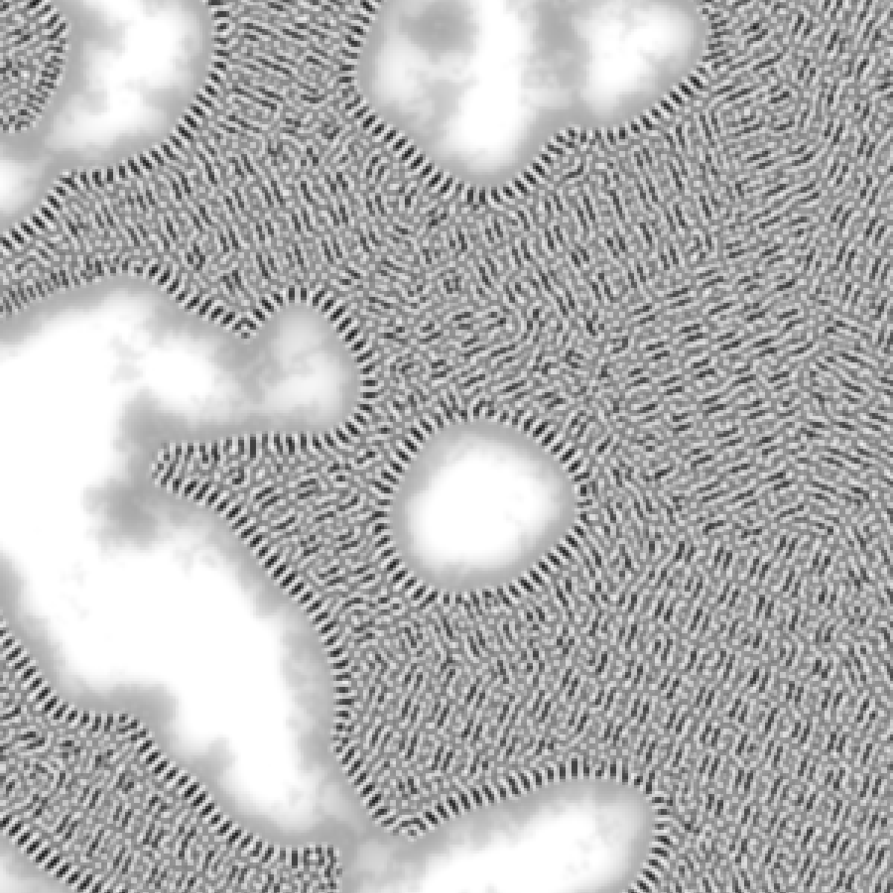
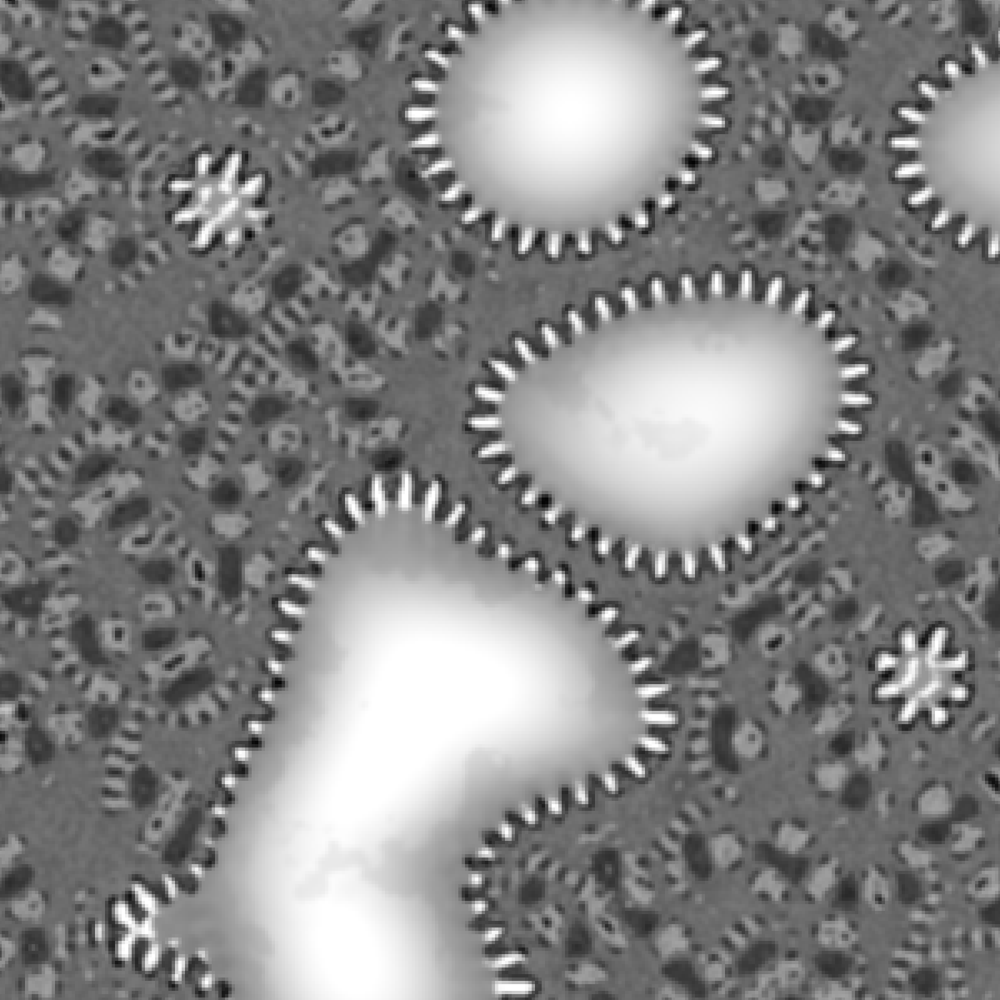

# MNCA Discovery Tool
A tool for discovering and designing selective multiple neighborhood cellular automata. Big thank you to Slackermanz who explained a lot of this difficult shit to me!<br><br><br>

# Multiple Neighborhood Cellular Automata
(Source: https://slackermanz.com/understanding-multiple-neighborhood-cellular-automata/) <br><br>
MNCA builds upon the concepts of Conway's game of life, utilizing 1) larger, more complex neighborhoods (often as 1 or more annuli) 2) multiple such neighborhoods, hence the name. Similary to Conway's, we take the average value of a neighborhood (neighborhood sum / neighborhood max) and compare this value to some predetermined pair of thresholds to decide the value of the pixel. Unlike Conway's, we do this calculation for every neighborhood to settle on the final value, which can be done by setting the value as 1 or 0 explicitly or adding/subtracting a weight.
### Selective MNCA
Selective MNCA (also by Slackermanz) is a variant of MNCA, in which we calculate multiple MNCA rulesets per pixel per frame, and use some function to score each ruleset and pick one for that particular pixel and frame. SMNCA massively increases the parameter space and expressive capability of MNCA.<br><br><br>

# My SMNCA pattern design
My tool randomizes the following parameters: <br>
```
* 8 (outer radius, inner radius) neighborhoods as annuli, radius in [0, 12]
* 32 thresholds / 16 rule pairs, value in [0, 1]
* 16 weights, value in [0, 1]
```
We then create four candidate rulesets to select from. Each candidate ruleset consists of 2 neighborhoods, and each neighborhood is given 2 rules. A rule consists of 2 threshold values (low, high): if the neighborhood average falls within this range, we apply the corresponding weight for this rule. Thus, each candidate is its own MNCA "pattern". (note that we do NOT sum all the rules, each candidate produces its own value)
```
Candidate 1
  c1_pixel = original_pixel
  Neighborhood A
    if neighborhood avg within (lowA1, highA1): add weightA1 to c1_pixel
    if neighborhood avg within (lowA2, highA2): add weightA2 to c1_pixel
  Neighborhood B
    ...
Candidate 2
  c2_pixel = original_pixel
  ...
```
To encourage robust patterns that don't skew towards 0 or 1, we enforce that the sum of the weights (which randomly fall between 0 and 1) falls between -0.5 and 0.5. To increase the parameter space, we also don't enforce rules like low < high for threshold values, allowing for dud rules. <br><br>
Ultimately, each candidate produces its own value based on the original pixel value, and we choose the candidate value that changes the pixel value MOST as our new pixel value. There are a number of different ways to score the candidates, but this method seems to work well.
### Developing a Ruleset
While randomizing patterns can produce interesting results, we can take individual patterns further by modifying them to our liking. Here is an example of a pattern I discovered by randomizing and the new pattern I developed from it:
<table>
  <tr>
    <td align="center" width="25%">
      <br>
    </td>
    <td align="center" width="25%">
      <br>
    </td>
  <tr>
<table>
Because the parameter space is so huge, editing a pattern by hand is near impossible. Instead, I apply small but random changes to the ruleset. If I don't like the updated pattern, I discard it and revert to the previous ruleset. If I do, I keep iterating until I reach a pattern I'm happy with. <br><br><br>

# Seeding the pattern
Initially, I was seeding my patterns with classic Perlin noise, which looks something like:

